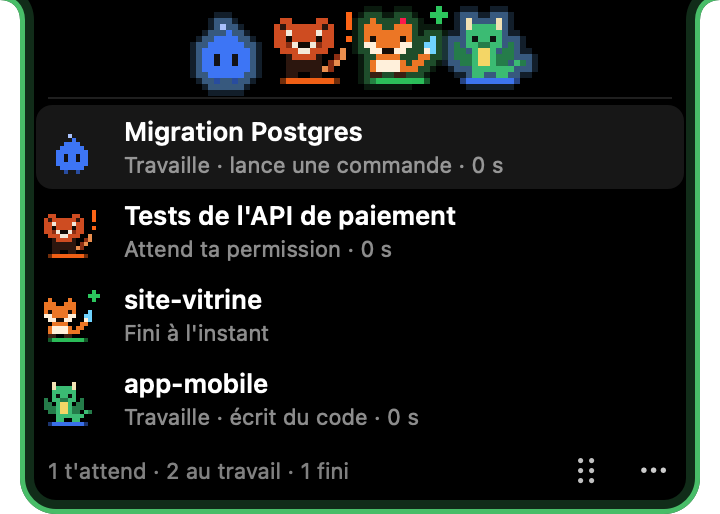
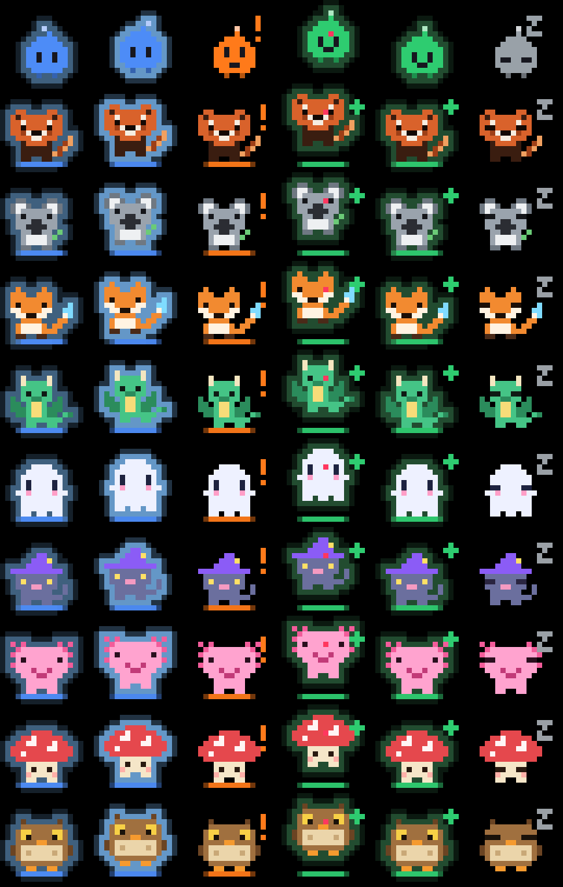

# Lutins

Une petite encoche en haut de l'écran du Mac, avec **un perso par session Claude Code**, pour savoir d'un coup d'œil si Claude travaille, t'attend ou a fini.

**[Voir la page de présentation →](https://lucasjanvierpro-oss.github.io/lutins/)**


Ça marche avec l'app Claude (onglet Code), Claude Code en terminal et dans VS Code.

## Ce que montrent les persos

| État | Ce que tu vois |
|---|---|
| **Il travaille** | il saute et brille en bleu (halo qui pulse), halo bleu au sol |
| **Il t'attend** (permission, question, plan) | il s'agite, un « ! » orange clignote |
| **Il a fini** | confettis et gros saut, halo vert, « + » vert, et **tout le contour de l'encoche pulse en vert** jusqu'à ce que tu cliques dessus |
| **Il dort** | yeux fermés, « z » — il disparaît au bout d'un moment |

Au survol, l'encoche s'agrandit et liste les sessions avec le titre de la discussion et ce qu'elle fait.



## Les persos au choix

Lutin, panda roux, koala, renard magique, petit dragon, fantôme, chat sorcier, axolotl, champignon, chouette — ou un différent par session.



## Installation

Il faut macOS 13 ou plus récent et les outils de développement Xcode (`xcode-select --install`).

```bash
git clone https://github.com/lucasjanvierpro-oss/lutins.git
cd lutins
./build.sh --install
```

L'app est copiée dans `~/Applications/Lutins.app` et lancée. Au premier lancement elle :

- ajoute ses hooks dans `~/.claude/settings.json` (une copie de l'ancien fichier est gardée dans `settings.json.lutins-backup`) ;
- s'ajoute à l'ouverture du Mac ;
- demande l'autorisation d'envoyer une notification quand une session a fini.

## Utilisation

- **Clic sur un perso** : ouvre Claude (ou le terminal de la session).
- **Glisser l'encoche** (par la poignée ⠿ ou n'importe où) : près du haut elle s'y recolle, ailleurs elle devient une pastille libre. Sa position est gardée pour chaque écran.
- **Clic droit ou ⋯** : réglages — taille, personnage, écran, son, notification, ouverture au démarrage, remettre l'encoche au centre, débrancher.

## Comment ça marche

Claude Code envoie ses événements (`UserPromptSubmit`, `PreToolUse`, `PostToolUse`, `PermissionRequest`, `Notification`, `Stop`, `SessionEnd`) à l'app par des hooks `curl` vers `127.0.0.1:3850`. Rien ne sort de la machine : le serveur n'écoute qu'en local. Le titre de chaque discussion est lu dans le transcript de la session (`~/.claude/projects/…`).

Pour rester affichée pendant le glissement d'un bureau à l'autre, l'encoche utilise des fonctions privées de macOS (SkyLight), comme les autres apps d'encoche.

| Fichier | Rôle |
|---|---|
| `Core.swift` | sessions, lecture des transcripts, serveur des hooks, branchement dans `settings.json` |
| `Island.swift` | l'encoche : fenêtres, survol, déplacement, dessin |
| `Sprites.swift`, `Creatures.swift`, `Effects.swift` | les persos en pixel art et leurs effets |
| `Notifier.swift` | la notification de fin |
| `Spaces.swift` | l'encoche visible sur tous les bureaux |
| `main.swift` | l'app, les réglages, les aperçus |

`Lutins --preview-skins fichier.png` et `Lutins --preview-island dossier` génèrent les images de ce README. La page de présentation (`docs/index.html`, publiée avec GitHub Pages) redessine les persos en direct à partir des mêmes dessins.

## Désinstaller

Clic droit sur l'encoche → **Débrancher de Claude Code et quitter**, puis supprimer `~/Applications/Lutins.app`.
